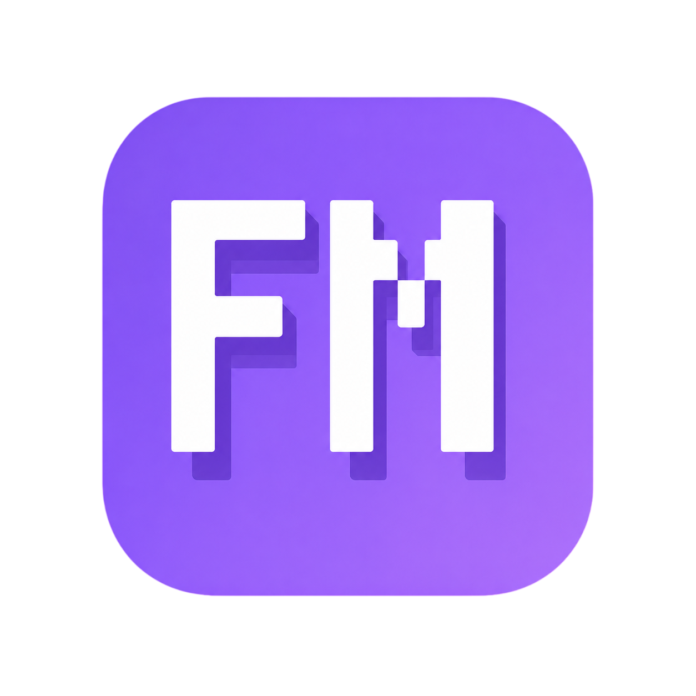

# FizMine Panel

<p align="center">
  
</p>

<p align="center">
  
  
  
  
</p>

<p align="center">
  <b>Lightweight, cross-platform Minecraft server management panel with a modern dark UI.</b>
</p>

<p align="center">
  <a href="#quick-start">Quick Start</a> •
  <a href="#features">Features</a> •
  <a href="#configuration">Configuration</a> •
  <a href="#commands">Commands</a>
</p>

---

## What's New

### v3.0

| Change | Description |
|----------|------------|
| **Authentication** | • Login with protection against settings tampering via `/api/settings`<br>• Anti-brute-force protection: 5 failed attempts = 5-minute lockout<br>• Weak password rejection (minimum 5 characters, common words blocked) |
| **Server Core Dashboard** | • Memory, disk, and CPU usage displayed in percentages<br>• Click any metric to open ring chart diagrams<br>• Real-time chart updates<br>• Crash detection with sound alerts |
| **File Manager** | • Sort by name (all languages) and file size<br>• Recursive file search<br>• File upload and download support<br>• Automatic ZIP compression for folder downloads<br>• Delete confirmation before removal |
| **Server Core** | • Core replacement functionality<br>• Select files to keep during replacement<br>• All unselected files are automatically deleted |
| **Settings** | • Accent color customization<br>• Firefly particle effects<br>• Panel opacity slider<br>• Authentication options<br>• Backup management |
| **Console & Players** | • Fixed command output issues<br>• Fixed real-time output updates<br>• Improved OP, whitelist, and ban management |
| **Cross-platform** | • Linux and Windows support<br>• Automatic Flask installation<br>• Automatic Java detection |


---

## Features

### Dashboard
- Real-time server status, memory usage, TPS, player count
- Start / Stop / Restart with one click
- Live console preview

### Server Setup
- Upload `server.jar` via drag & drop (Spigot, Paper, Purpur, Forge, etc.)
- Auto-accept EULA, generate `server.properties`
- Replace core with toggle options: keep or delete world, mods, plugins, ops, bans, whitelist

### Console
- Live server console with auto-scroll
- Send any command directly from the panel

### Player Management
- Online players list
- Add / Remove OPs, Whitelist, Banned players
- UUID resolution for both **premium** and **offline (cracked)** accounts
- Uses server commands (`op`, `ban`, `pardon`, `whitelist add/remove`) — no restart needed

### Files
- Edit `server.properties` with validation
- Browse server files with folder navigation and breadcrumbs
- Edit `.json`, `.yml`, `.txt`, `.properties` and other text files directly

### Plugins & Mods
- Upload `.jar` files via drag & drop or file picker
- Delete individual or all plugins/mods
- Delete All button when more than 2 installed

### Settings
- Multi-language: **English**, **Русский**, **Deutsch**, **Français**, **中文**
- Accent color picker with 10 presets + custom color
- Fireflies ambient background effect (toggle)
- Java auto-detection (prefers Java 17+)
- RCON support for reliable command delivery
- MC_DIR, PANEL_PORT, JAVA_ARGS, JAVA_ENCODING configurable from UI

---

## Quick Start

### 1. Download panel

Download the archive.
Unzip it into the server folder.

### 2. Configure

```bash
nano .env
```

In `.env` set up what you need (for example, take the `.env.example`):

```env
MC_DIR=YOURFOLDER
PANEL_PORT=8080
```

> In the new version, you can remove `PANEL_LANG` from `.env` and set the language through the panel settings.

### 3. Run

```bash
python3 ctl.py start
```

Open **http://localhost:8080** in your browser.

---

## Commands

```bash
python3 ctl.py start     # Start the panel
python3 ctl.py stop      # Stop the panel
python3 ctl.py restart   # Restart the panel
python3 ctl.py status    # Check panel status
```

---

## Configuration

All settings are in `.env`:

| Variable | Default | Description |
|----------|---------|-------------|
| `MC_DIR` | `/minecraft` | Minecraft server directory |
| `PANEL_PORT` | `8080` | Panel web port |
| `PANEL_LANG` | `en` | Panel language (`en`, `ru`, `de`, `fr`, `zh`) |
| `JAVA_PATH` | *(auto)* | Path to Java executable |
| `JAVA_ARGS` | `-Xmx2G -Xms1G` | JVM arguments |

---

## Windows Support

FizMine Panel works on both **Linux** and **Windows**.

---

## Requirements

- Python 3.8+
- Java 17+
- Minecraft server jar (Spigot, Paper, Purpur, Forge, etc.)

---

## Screenshots

<p align="center">
  
  
</p>

<p align="center">
  
</p>

---

## License

MIT License
