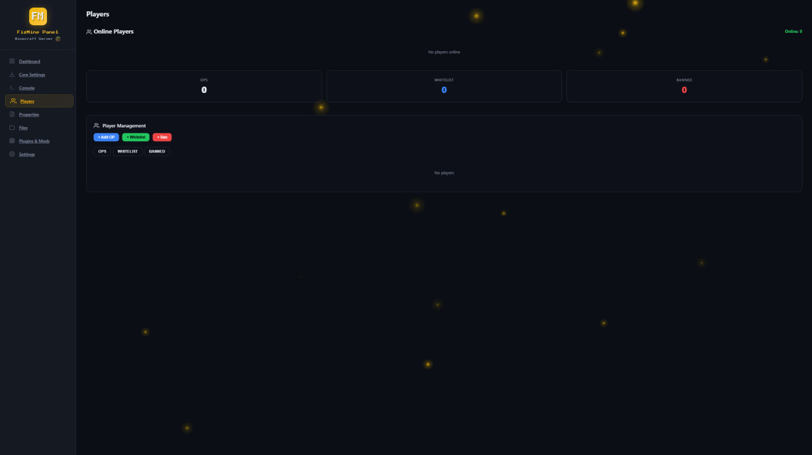
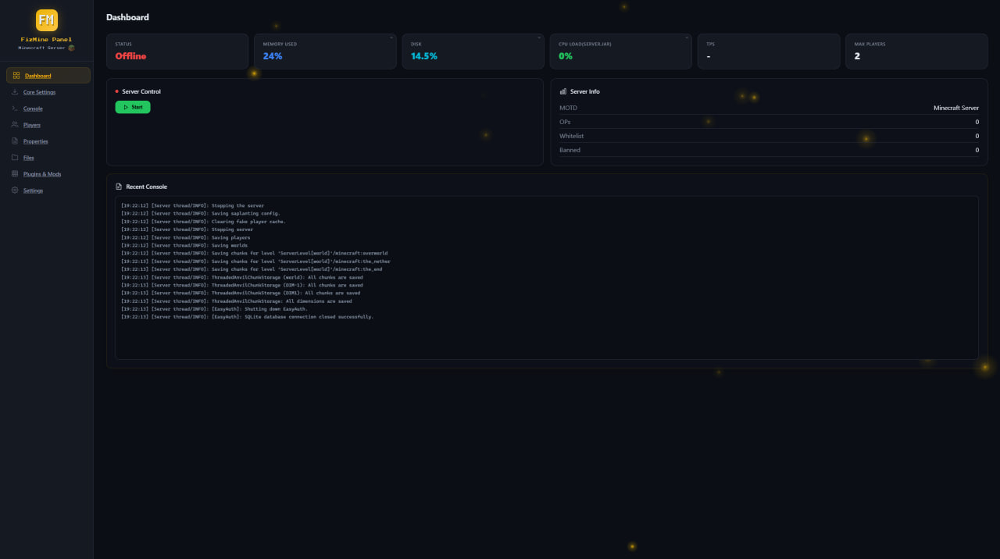
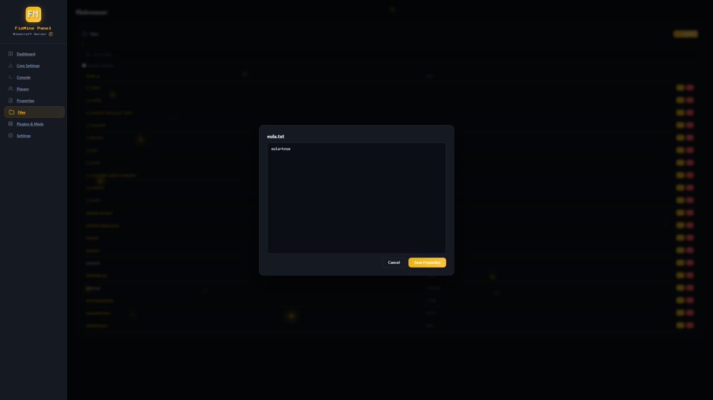

# FizMine Panel

Powerful Minecraft server management panel built with Python/Flask.

## Screenshots







## Quick Install

### Linux

```bash
curl -sLO https://raw.githubusercontent.com/fizyCH/FizMine/main/install.sh && bash install.sh
```

### Windows (PowerShell)

```powershell
irm https://raw.githubusercontent.com/fizyCH/FizMine/main/install.ps1 | iex
```

### Manual Install

1. Download from [Releases](https://github.com/fizyCH/FizMine/releases)
2. Extract to your Minecraft server directory
3. Run: `python panel.py`

## Requirements

- Python 3.7+
- Java 17+ (for Minecraft server)

## Usage

```bash
./ctl.sh start      # Start panel
./ctl.sh stop       # Stop panel
./ctl.sh restart    # Restart panel
./ctl.sh status     # Check status
./ctl.sh log        # View logs
```

## What's New

| Status | Change | Description |
|--------|--------|-------------|
| FIXED | Java check on startup | Displays the Java version in the terminal when the panel starts |
| NEW | Check for updates | Button in Settings → System for checking for updates from GitHub |
| NEW | Purpur core | Added Purpur (Bukkit/Spigot hybrid) for download |
| NEW | Arclight core | Added Arclight (Forge+Bukkit hybrid) for download |
| FIXED | Automatic Flask installation | Added sudo pip fallback, improved error messages |
| BETA | Update checker | Check for updates button in Settings with auto-install |
| FIXED | NeoForge installer | Fixed --installServer flag, increased timeout to 600s |
| NEW | Fabric loader updated | Updated to loader 0.19.3 for all versions |
| NEW | Search in plugins/mods | Quick search filter for installed plugins and mods |
| NEW | Interactive menu | ctl.sh/ctl.ps1 with Start, Stop, Restart, Status, Port, Java, Delete |
| FIXED | .env path handling | Fixed tilde expansion and absolute path resolution |
| NEW | Install script prompts | Interactive setup: install path, auth, port |
| NEW | Multi-distro support | apt, dnf, yum, pacman, apk for Linux |
| NEW | Auto Java install | Install script auto-installs Java 17 if missing |
| NEW | 5 languages | English, Russian, German, French, Chinese |
| NEW | Fireflies animation | Ambient particles with accent color |
| NEW | Accent color picker | Customizable panel theme colors |
| NEW | Panel opacity | 0-100% transparency slider |
| NEW | Authentication | Login with anti-brute-force (5 attempts = 5 min lockout) |
| NEW | File manager | Upload, download, edit, delete files |
| NEW | Search in files | Recursive search across subdirectories |
| NEW | Server core download | Vanilla, Purpur, Fabric, Arclight |
| NEW | Backup | Panel + server backup download |
| NEW | Crash detection | Sound notification when server crashes |
| NEW | Cross-platform | Linux + Windows support |
