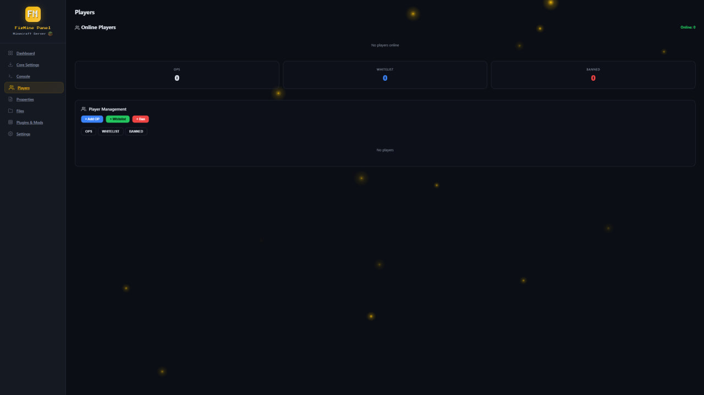
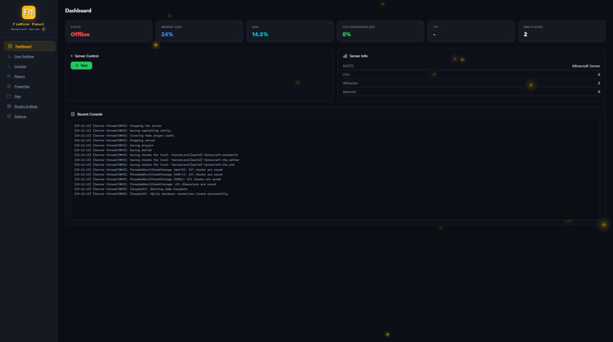
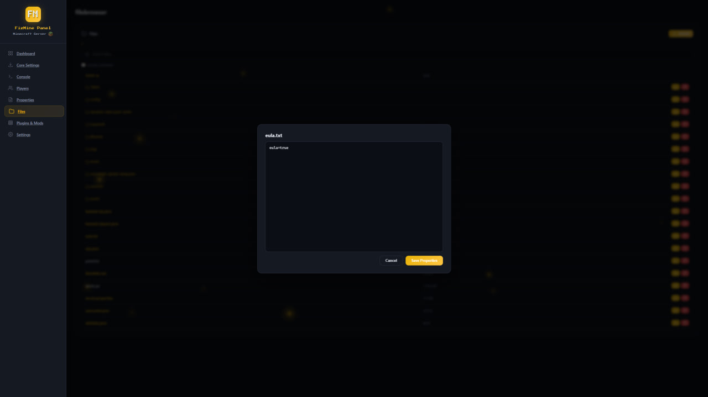

# FizMine Panel

Powerful Minecraft server management panel built with Python/Flask.

## Screenshots







## Quick Install

### Linux

```bash
curl -sLO https://raw.githubusercontent.com/fizyCH/FizMine/main/install.sh && bash install.sh
```

### Windows (PowerShell)

```powershell
irm https://raw.githubusercontent.com/fizyCH/FizMine/main/install.ps1 | iex
```

### Manual Install

1. Download from [Releases](https://github.com/fizyCH/FizMine/releases)
2. Extract to your Minecraft server directory
3. Run: `python panel.py`

## Requirements

- Python 3.7+
- Java 17+ (for Minecraft server)

## Usage

```bash
./ctl.sh start      # Start panel
./ctl.sh stop       # Stop panel
./ctl.sh restart    # Restart panel
./ctl.sh status     # Check status
./ctl.sh log        # View logs
```

# Version 3.0

## What's New

| Category | Changes |
|----------|----------|
| Account System | Added a full account system with **Administrator** and **User** roles. |
| User Management | - Create, edit, and delete users.<br>- Change nickname and password.<br>- Change user roles.<br>- Demote administrators to regular users. |
| Permissions | Added flexible permission management for:<br>- Console<br>- Server management<br>- Files<br>- Properties<br>- Plugins and Mods<br>- Player management<br><br>Administrators have unrestricted access. |
| File Browser | Added a built-in server file browser with support for creating files. |
| Mobile Interface | Added an adaptive interface for mobile devices (**BETA**). |
| Modular Architecture | The application has been split into modules:<br>- `app.py`<br>- `auth.py`<br>- `users.py`<br>- `server.py`<br>- `files.py`<br>- `settings.py`<br>- `rcon.py`<br>- `backup.py`<br>- `panel.py` (compatible launcher) |
| Panel Updater | Added an automatic updater that:<br>- Checks the latest version via `app.py`.<br>- Downloads `app.py`, `panel.py`, and all modules.<br>- Creates `.bak` backups before updating.<br>- Restarts the panel automatically. |
| First Administrator | On the first launch, the panel automatically creates an administrator account:<br>- Login: `admin`<br>- Random secure password<br>- Credentials are displayed in a formatted table. |
| Automatic Account Generation | Accounts are automatically initialized when the panel is launched using `ctl.sh` or `ctl.ps1`. |
